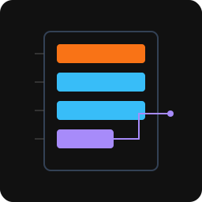

<p align="center">

</p>

<h1 align="center">procmod-layout</h1>

<p align="center">Struct mapping with pointer chain traversal via derive macros.</p>

---

Map remote process memory into Rust structs. Declare byte offsets on each field, optionally follow pointer chains through multiple indirections, and read the entire struct in one call. Built on [procmod-core](https://github.com/procmod/procmod-core).

## Install

```toml
[dependencies]
procmod-layout = "1"
```

## Quick start

Read a game's player state from a known base address:

```rust
use procmod_layout::{GameStruct, Process};

#[derive(GameStruct)]
struct Player {
    #[offset(0x100)]
    health: f32,
    #[offset(0x104)]
    max_health: f32,
    #[offset(0x108)]
    position: [f32; 3],
}

fn main() -> procmod_layout::Result<()> {
    let game = Process::attach(pid)?;
    let player = Player::read(&game, player_base)?;
    println!("hp: {}/{}", player.health, player.max_health);
    println!("pos: {:?}", player.position);
    Ok(())
}
```

## Usage

### Basic struct mapping

Every field needs an `#[offset(N)]` attribute specifying its byte offset from the base address. The derive macro generates a `read(process, base) -> Result<Self>` method.

```rust
use procmod_layout::{GameStruct, Process};

#[derive(GameStruct)]
struct GameSettings {
    #[offset(0x00)]
    difficulty: u32,
    #[offset(0x04)]
    volume: f32,
    #[offset(0x08)]
    fov: f32,
    #[offset(0x10)]
    mouse_sensitivity: f64,
}
```

### Pointer chains

When a value is behind one or more pointer indirections, use `#[pointer_chain(...)]` to follow the chain automatically. The offsets list the intermediate dereference offsets before reading the final value.

For example, reading a damage multiplier stored behind two pointer hops:

```rust
use procmod_layout::{GameStruct, Process};

#[derive(GameStruct)]
struct CombatState {
    #[offset(0x50)]
    is_attacking: u8,
    #[offset(0x54)]
    combo_count: u32,
    #[offset(0x60)]
    #[pointer_chain(0x10, 0x08)]
    damage_mult: f32,
}

// The pointer chain for damage_mult reads:
//   1. read pointer at (base + 0x60)
//   2. read pointer at (ptr + 0x10)
//   3. read f32 at (ptr + 0x08)
```

### Composing with procmod-scan

Use [procmod-scan](https://github.com/procmod/procmod-scan) to find a structure's base address after a game update, then read it with a layout:

```rust
use procmod_layout::{GameStruct, Process};
use procmod_scan::Pattern;

#[derive(GameStruct)]
struct Inventory {
    #[offset(0x00)]
    slot_count: u32,
    #[offset(0x04)]
    gold: u32,
    #[offset(0x10)]
    weight: f32,
}

fn find_inventory(process: &Process, module: &[u8], module_base: usize) -> procmod_layout::Result<Inventory> {
    let sig = Pattern::from_ida("48 8D 0D ? ? ? ? E8 ? ? ? ? 48 8B D8").unwrap();
    let offset = sig.scan_first(module).expect("inventory signature not found");
    let base = module_base + offset;
    Inventory::read(process, base)
}
```

## Supported types

All field types must be `Copy` and valid for any bit pattern. Types with validity invariants (`bool`, `char`, enums) must not be used - read them as their underlying integer type instead (e.g., `u8` for booleans).

- Numeric primitives: `u8`, `u16`, `u32`, `u64`, `i8`, `i16`, `i32`, `i64`, `f32`, `f64`, `usize`
- Fixed-size arrays: `[f32; 3]`, `[u8; 16]`, etc.
- Any `#[repr(C)]` struct that is `Copy` and valid for any bit pattern

## License

MIT
